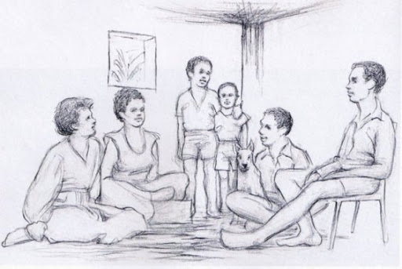

یک تئوری جالب وجود داره که می گه:

> "ادراک شما از آنچه می بینید، می تواند نتیجۀ محیط و فرهنگی باشد که در آن زیسته اید."

به تصویر زیر نگاه کنین... چیزی که می بینین تا حد زیادی بستگی به جایی داره که توش زندگی می کنین:

 

خوب؟! چی دیدین؟

تقریبا همۀ مردم شرق آفریقا، گفتن که اون خانوم داره یه جعبه یا همچین چیزی رو با سرش نگه می داره و این افراد زیر یک درخت نشستن، و غربی ها هم گفتن که اونها توی یک اتاقن و بالای سر اون خانوم هم یک پنجره است.

و همینطور:

[این فونت نستعلیق](http://dl.p30download.com/font/IranNastaliq_Font-[p30download.com].zip) رو که کاملا استاندارد طراحی شده و به راحتی قابل استفاده است رو از دست ندین.
