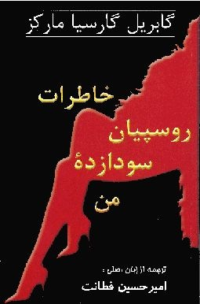

> "ای كاش زندگی چیزی نبود كه مثل  رود گل آلود هراكلیت بگذرد، بلكه  فرصت نادری بود تا در ماهیتابه از این رو به آن رو شویم و طرف دیگرمان هم تا نود سال دیگر سرخ میشد."

&nbsp;&nbsp;&nbsp;&nbsp;&nbsp;&nbsp;&nbsp;
&nbsp;&nbsp;&nbsp;&nbsp;&nbsp;&nbsp;&nbsp;\- گابریل گارسیا مارکز، خاطرات روسپیان سودازدۀ من

از آنجایی که توی کشور ما پس از اینکه چیزی توقیف می شه، 95% مردم بهش دست پیدا می کنن، من هم پس از توقیف چاپ دوم کتاب "خاطرات دلبرکان غمگین من" نوشتۀ "گابریل گارسیا مارکز"، نسخۀ اینترنتی این کتاب رو با نام "خاطرات روسپیان سودازدۀ من" با ترجمۀ "امیرحسین فطانت" به راحتی به دست آوردم.

باید بگم این کتاب بر خلاف اونچیزی که از عنوانش به نظر می رسه، و همونطور که از نام نویسندش پیداست، یک شاهکاره! پرداخت دقیق به جزئیات، و وصف دقیق روحیات قهرمان داستان، که یک پیرمرد 90 ساله است آدم رو لحظه به لحظه بیشتر به خودش جذب می کنه؛ به طوری که خوندن سه، چهار صفحۀ اول کتاب برای اینکه تو رو متقاعد کنه که تا آخرین صفحۀ این رمان 100 صفحه ای دست از خوندن بر نداری، کافیه.

البته، باید از وزارت ارشاد عزیز هم که با توقیف کردن این کتاب، هم باعث گسترش اینترنتی کتاب و هم باعث کنجکاوی من برای خوندنش شد، تشکر کنم.

در ضمن... نسخۀ PDF این کتاب رو می تونید از [اینجا](http://www.fileden.com/files/2008/8/1/2029958/Marquez%20-%20Khaterate%20Roospiane%20Sodazade.pdf) دانلود کنید...!
