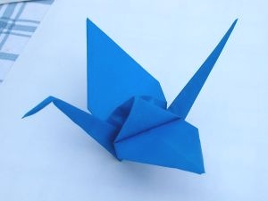

حتما تا به حال شده که با کاغذ، هواپیما یا کشتی درست کنین. اینها اشکال ساده ای هستند که تقریبا هر بچه ای یاد داره. ولی هیچ می دونستین که چقدر دیگه از این اشکال ساده می شه با یک برگ کاغذ و بدون استفاده از قیچی درست کرد؟

اُریگامی، یا هنر تا کردن کاغذ، اولین بار در چین ابداع شد. تنها ابزاری که برای این هنر لازمه، یک برگ کاغذ مربع شکله که طرفینش می تونن رنگهای مختلفی رو داشته باشن.

توی [این صفحه](http://dev.origami.com/diagram.cfm)، می تونین لیست تقریبا کاملی رو از این اشکال به همراه نحوۀ ساختشون پیدا کنین.

و همینطور عکس زیر یک [درنای کاغذی](http://dev.origami.com/diagram_load.cfm?pdfname=trad_page1.pdf)ه، که یکی از زیباترین و مشهورترین اشکال سادۀ اریگامی است:

