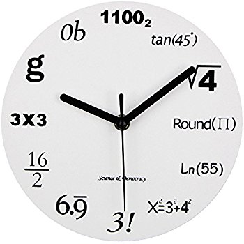

یادم میاد وقتی 5، 6 سالم بود. بابام روی خوندن ساعت باهام کار می کرد، و فکر می کنم کلاس سوم بود که توی کتاب ریاضی خوندن ساعت رو آموزش می داد. اون موقع دیگه من ساعت خوندن رو بلد بودم ولی یادم میاد که بعضی از بچه ها مشکلاتی داشتن تا بالاخره تونستن ساعت رو بخونن.

اگر شما هم جزو اونایی هستید که مشقتهای زیادی برای گفتن زمان تحمل کردین، خدا رو هزاران مرتبه شکر کنید که چنین ساعتی اون روزها نبود  که بخواین از روش ساعت خوندن رو تمرین کنین:

توضیحات:

\- برای ساعت 6 از فاکتوریل استفاده شده: "!3" برابر است با: "3x2x1"

\- محاسبات برای ساعت 7 به ...6.999 ختم می شه، که این عدد برابر 7 است. ([توضیح در ویکی پدیا](http://en.wikipedia.org/wiki/0.999...))

برای خرید ساعت به [اینجا](http://www.cafepress.com/triplenine.2445706) مراجعه کنید. البته مسلما با داشتن کارتهای اعتباری معتبر جهانی.
