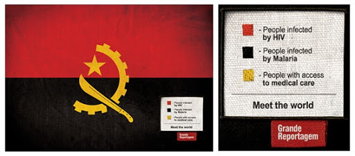
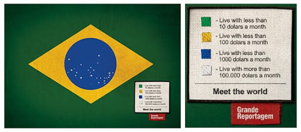
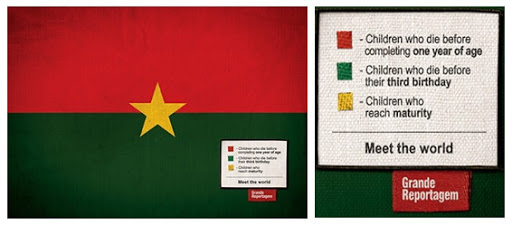
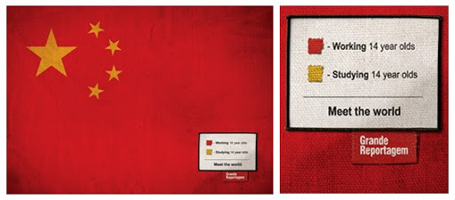
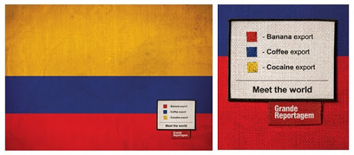
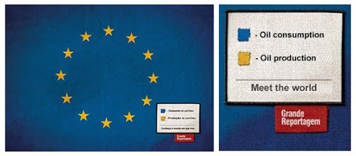
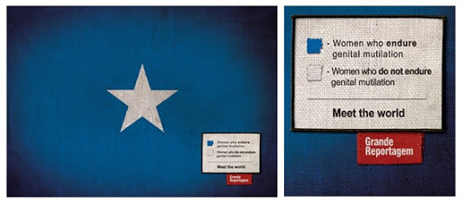
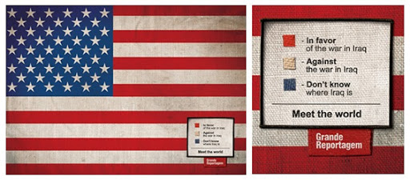

"ایکارو دوریا"، یک جوان 25 سالۀ برزیلی است که برای مجلۀ Revista Grande Reportagem در پرتقال کار می کند، و همراه با "لوییس سیلوا دیاس"، "خوزو روکو" و "آندرآ والنتی" کمپینی به نام "کمپین پرچم (flag campaign)" رو راه انداختند و تا کنون 8 پرچم کشورهای مختلف رو از طریق ای میل پخش کردند...

ایدۀ اصلی این کمپین "بیان مسائلی که در دنیای امروز مهم است"، می باشد. این پروژه بر طبق آمارهای واقعی و انطباق این آمارها با پرچم کشورها انجام گرفته است و نگرانی های امروز رو در قالب این پرچمها بیان کرده است.

**آنگولا**

قرمز: مبتلایان به HIV

سیاه: مبتلایان به مالاریا

زرد: تحت پوشش خدمات درمانی

**برزیل**

سبز: درآمد ماهانه زیر 10 دلار

زرد: درآمد ماهانه زیر 100 دلار

آبی: درآمد ماهانه زیر 1000 دلار

سفید: درآمد ماهانه بیش از 000'100 دلار

**بورکینا فاسو**

قرمز: کودکانی که زیر یک سال می میرند

سبز: کودکانی که زیر سه سال می میرند

زرد: کودکانی که بالغ می شوند

**چین**

قرمز: 14 ساله هایی که کار می کنند

زرد: 14 ساله هایی که درس می خوانند

**کلمبیا**

قرمز: صادرات موز

آبی: صادرات قهوه

زرد: صادرات کوکایین

**اتحادیۀ اروپا**

آبی: مصرف کنندۀ نفت خام

زرد: تولید کنندۀ نفت خام

**سومالی**

آبی: زنانی که ختنه شدن را تحمل می کنند

سفید: زنانی که ختنه شدن را تحمل نمی کنند

**ایالات متحده آمریکا**

قرمز: موافق با جنگ عراق

سفید: مخالف با جنگ عراق

آبی: نمی‌دانند عراق کجاست

منابع: [چلچراغ](http://www.40cheragh.org)، [Adland](http://commercial-archive.com/node/120599v)، [Brazilian Artist](http://www.brazilianartists.net/home/flags/index.htm)
