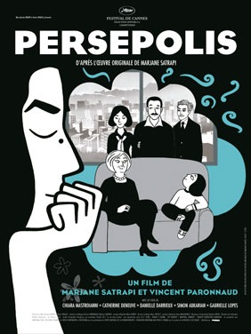

درست در شب قبل از انتخابات، فیلمی به دست من رسید که دست آوردهای بزرگترین انتخابات برگزار شده در ایران رو از دید دختری که هم سن و سال انقلاب است، به نمایش می گذاشت.

فیلم انیمیشن پرسپولیس ساختۀ "مرجانه ساتراپی"، کارگردان ایرانی الاصل مقیم فرانسه و نویسنده رمان کمیک به همین نام با همکاری "وینسنت پارانوید" است، که برنده چندین جایزه مهم از جمله جایزه نخل طلایی جشنواره کن، و جایزه ساترلند جشنواره فیلم لندن شده و همچنین نامزد جایزه اسکار نیز بوده.

این فیلم روحیات یک دختر ایرانی رو نمایش می ده که افراد خانواده اش مستقیما در انقلاب بر ضد رژیم شاه و برای دستیابی مجدد آزادیشان ایستادگی کردند و پس از انقلاب، آنچنان که همه می دانیم حاصل آن همه "مرگ بر شاه"ها و زندان ها و شکنجه ها چیزی جز شعار آزادی یک عده مرد ریش دار و زن چادر سیاه نبود. دختری که در دوران نوجوانی مجبور می شود موهایش را بپوشد، به موسیقی موسیقی مورد علاقه اش گوش ندهد و در عوض در گوشش از دست آوردها و آزادی های انقلاب می خوانند.

پدر و مادر این دختر از ترس جنگ و دولت او را به مدرسه ای در فرانسه می فرستند و او آنجا نیز همچنان ایرانیست...! دوری از خانواده و حس عذاب وجدان حاصل از عدم امنیت خانواده اش از یک طرف و فرهنگ نامفهوم غرب از طرف دیگر او را وا میدارد تا پس از چند سال دوباره به ایران بازگردد و حاصل این برگشت و مواجه شدن دوباره با تمام محدودیتها چیزی جز افسردگی و قرصهای آرامبخش نیست... تا جایی که پس از یک ازدواج زود هنگام و ناکام که به دلیل محدودیتهای دینی حاکم بر کشور انجام شد دوباره به فرانسه بازگشت و این بار همونجا موندگار شد.

خود خانم ساتراپی این فیلم را به هیچ عنوان سیاسی نمی داند، در حالی که مسئولین وزارت فرهنگ و ارشاد از پخش این فیلم در جشنواره کن به دلیل "روحیه ضد ایرانی فیلم" شکایت کردند. در عین حال بیشتر داستان فیلم بر اساس زندگی خود مرجانه ساتراپی، یک "ایرانی" مقیم فرانسه است و چطور به چنین فیلمی می توان برچسب غیرایرانی بودن رو چسبوند؟ همه ما با داستان زندگی این دختر آشناییم و گاه و بیگاه صحنه هایی از این فیلم رو در زندگی روزمرۀ خودمون تجربه کردیم. در واقع همه ما می بینیم که چگونه همیشه از نظر حکومت مجرمیم... اگر به موسیقی مورد علاقه مان گوش می دهیم، اگر لباس مورد علاقه مان رو می پوشیم، اگر به سایتهای اینترنتی مورد علاقه مان سر می زنیم و اگر عاشق هستیم...!

من یک منتقد نیستم و شاید نظر من آنچنان پخته نباشد اما از نظر من این فیلم با تمام روحیاتی که بر ضد حکومت دارد و با تمام تصاویر سیاهی که از یک جامعه ایرانی و ایرانی بودن نشان می دهد، به هیچ عنوان "غیر ایرانی" نیست بلکه به معنای کلمه "ایرانی"ست و واقعیت ایرانی بودن رو به زیبایی در تصاویر ساده فیلم نقل می کند.
