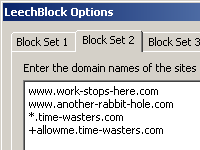
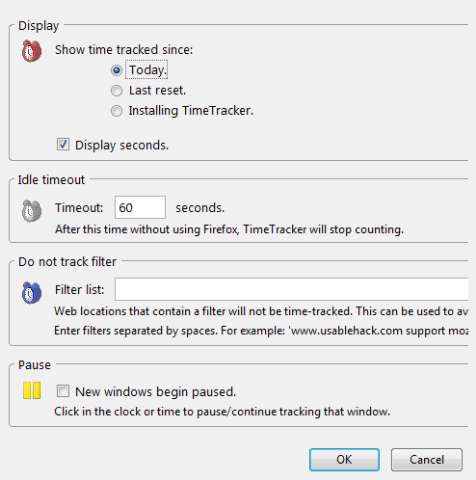
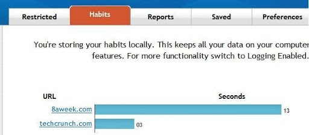
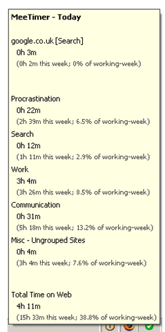
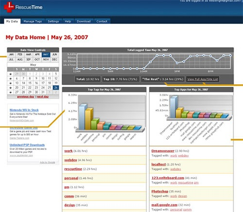

از امروز تعطیلات شروع شدند و خیلی از ما وقت زیادی رو توی خونه می گذرونیم و احتمالا ساعتهای زیادی پشت کامپیوتر، به بازدید از سایتهای مختلف می پردازیم! و مسلما خیلی از وقتمون خواسته یا ناخواسته هدر خواهد رفت! و احتمالا آخر تعطیلات، به فکر کارهای مفیدتری خواهید افتاد که می تونستین به جای گشت و گذار توی سایتهای بی فایده انجام بدید!

اینجا قصد معرفی 4 اکستنشن فایرفاکس و یک نرم افزار مفید رو دارم، که به مدیریت زمانی که توی اینترنت می گذرونید کمک زیادی می کنن... با کمک اینا می تونید گزارش کاملی از سایتهایی که بازدید می کنید رو داشته باشید و در صورت لزوم اونها رو محدود کنید:

**1- LeechBlock**

LeechBlock جلوگیری از بارگزاری بعضی از سایتها در فایرفاکس استفاده می شه. با استفاده از این اکستنشن شما می تونید حداکثر 5 "Block Set" بسازید. هر بسته می تونه چندین وبسایت رو جا داده در یک دوره زمانی خاص مسدود کند.

برای مثال شما می تونید یک set بسازید و تمام سایتهای دوستیابی مثل [ارکات](http://www.orkut.com)، [یاهو 360](http://360.yahoo.com)، [فیس بوک](http://www.facebook.com)، [مای اسپیس](http://www.myspace.com) و ... رو توش بذارید و تمام این سایتها رو در یک بازه زمانی خاص (مثلا 9 صبح تا 4 بعد از ظهر) مسدود کنید. و سپس یک set دیگه بسازید و در یک بازه زمانی دیگه سایتهای دیگه ای رو برای مسدود شدن مشخص کنید!

LeechBlock رو [دانلود کنید](https://addons.mozilla.org/en-US/firefox/addon/4476).

**2- Time Tracker**

یک اکستنشن ساده و کارآمد دیگه که مقدار زمانی که با فایرفاکس توی اینترنت می چرخیدین رو محسابه می کنه و توی نوار وضعیت فایرفاکس نمایش می ده:

همین طور که می بینید، در نوار وظیفه شما می تونید زمان محاسبه شده از امروز / آخرین ریست / و از زمان نصب این اکستنشن، مشاهده کنید. همچنین می تونید مشخص کنید که بعد از چند ثانیه استفاده نکردن از فایرفاکس شمارنده متوقف شود، می تونید چند سایت خاص رو از محاسبه شدن حذف کنید!

دانلود [Tme Tracker](https://addons.mozilla.org/en-US/firefox/addon/1887)

**3- 8aWeek**

مثل اکستنشن اولیست با این تفاوت که قابلیتهای بیشتری داره و می تونه با نمودار فعالیتهایی رو که در اینترنت انجام دادین رو نمایش بده:

شما می تونید با استفاده از این اکستنشن زمانی رو که روزانه از هز سایت استفاده می کنید محدود کنید، مثلا می تونید تنظیم کنید که سایت [بالاترین](http://www.balatarin.com/) بیش از 30 دقیقه در روز قابل دستیابی نباشد.

دانلود [8aWeek](http://8aweek.com/)

**4- MeeTimer**

یک اکستنشن خیلی ساده که زمان بازدید شده از هر سایت رو محاسبه می کنه و اونها رو در چند گروه مشخص نشون می ده (برای مثال، [MySpace](http://www.myspace.com)/[Facebook](http://www.facebook.com) = procrastination و [Gmail](http://www.gmail.com) = communication و ...)

در آخر روز شما یک تصویر مشخص از فعالیت روزانه خودتون خواهید داشت.

دانلود [MeeTimer](http://getmeetimer.com/)

**5- Rescue Time

**بر خلاف قبلی ها، Rescue Time یک نرم افزار مستقل است، تقریبا با همون اهداف...، محاسبه مقدار زمان گذرانده شده در سایتهای مختلف و نیز نرم افزارهای مختلف. نکته جالب در مورد این نرم افزار اتوماتیک بودن اکثر قسمتهای نرم افزار است... یعنی شما لازم نیست تنظیمات زیادی رو روی این برنامه انجام بدید!

نسخه های متفاوت این نرم افزار قابل اجرا بر روی ویندوز و لینوکس می باشد.

دانلود [Rescue Time](http://rescuetime.com/)

در این رابطه اگر نرم افزار دیگه ای هم می شناسین ما رو هم بی خبر نذارین!
