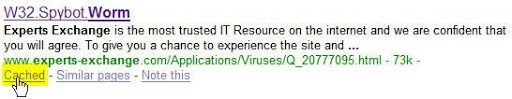

خیلی وقتا پیش میاد موقعی که من به مشکلی بر می خورم یا به دنبال فایلی برای دانلود می گردم، به سایتی می رسم که بدون ثبت نام اجازه استفاده از محتوای سایت رو نمی ده، یا حتی بد تر از این، گاهی حتی پول هم می خوان! این قضیه خصوصا در بسیاری از فرومهای اینترنتی اتفاق می افته که بدون عضویت اجازۀ استفاده از لینکها رو نمی دن!

اما به جای ثبت نام در چنین سایتهایی گاهی می شه از چند روش برای دور زدن این فرمهای ثبت نام استفاده کرد.

**1- Bug Me Not**

[bug me not](http://www.bugmenot.com) وبسایت جالبی است که نام کاربری و کلمه عبور برای ورود به اکثر سایتها و فورومها را دارد! در اکثر مواقع (به خصوص در مورد سایتهای پر طرفدار) این سایت می تونه به راحتی ما رو وارد سایت کنه... این سایت همچنین [یک اکستنشن فایرفاکس](http://erichamiter.com/firefox/bugmenot/) هم برای راحت تر شدن کار تدارک دیده...!

ولی با اینکه Bug Me Not بهترین روش ورود به سایتهای مختلف است، مسلما اطلاعات ورود به تمام سایتهای روی اینترنت رو نداره... در این صورت می شه از روشهای زیر هم استفاده کرد:

**2- Google Cache**

در این روش پس از جستجوی سایت از طریق [گوگل](http://www.google.com)، به جای کلیک بر روی لینک مستقیم سایت، بر روی "Cached" (در نسخه فارسی: "ذخیره شده") کلیک کنید تا صفحۀ اصلی که معمولا توسط گوگل ذخیره شده است، باز شه.

**3- Be The Bot**

در حالتهای خیلی نادر، که حتی گوگل هم کمکی نمی کنه! می شه از وبسایت [Be The Bot](http://www.avivadirectory.com/bethebot/) استفاده کرد. Be The Bot باعث می شه که شما به هنگام مراجعه به سایت مثل ربات جستجوی گوگل یا یاهو به نظر برسید و سایت اصلی برای شما باز بشه!

آیا روشهای دیگری هم برای دور زدن فرمهای ثبت نام به نظرتون می رسه! در این صورت حتما کامنت بذارید!
