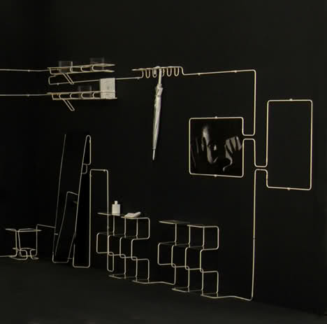
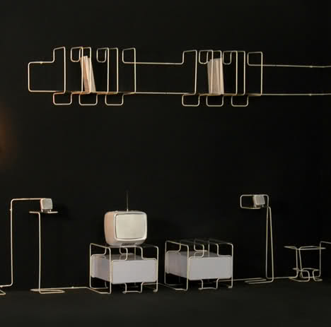
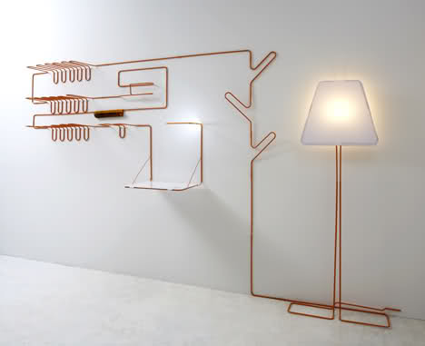
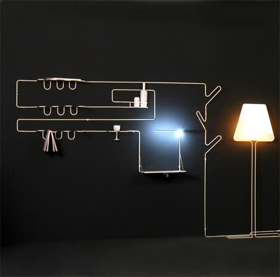

ممکنه سری انیمیشن ایتالیایی "La Linea" یا "خط" اثر "اسوالدو کاواندلی" رو دیده باشید، من همیشه سادگی و خلاقیتی که توی این انیمیشن به کار رفته رو تحسین می کنم! این انیمیشن بیش از 250 اپیزود داره که من توصیه می کنم حداقل یکی از اونها رو ببینید. خیلی راحت با یک گشت و گذار توی سایت [یوتیوب](http://www.youtube.com) می تونید تعداد زیادی از اونها رو پیدا کنید!

اما چیزی که باعث شد به یاد "خط" بیفتم، طرحهای لوازم منزلی است که طراحی به نام "آیکات ارول (Aykut Erol) طراحیشون کرده. در واقع ارول همین سیستم انیمیشن خط رو به دنیای واقعی آورده. مهمترین ویژگی "خط"، ممتد بودن اونه:

