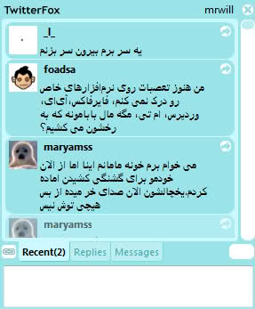

چنانچه از فایرفاکس استفاده می کنید حتما افزونه معروف [استایلیش (Stylish)](https://addons.mozilla.org/firefox/2108/) رو می شناسید. استایلیش کدهای css صفحات مختلف اینترنت رو دستکاری می کنه و صفحه رو به هر شکلی که شما دوست داشته باشید تبدیلش می کنه.

اگر اهل توییتر هم باشید به احتمال زیاد افزونه [توییترفاکس(twitterfox)](https://addons.mozilla.org/en-US/firefox/addon/5081) رو می شناسید. با استفاده از این اکستشن می شه به راحتی از داخل فایرفاکس توییت کرد و آخرین توییتهای رسیده رو چک کرد.

اما اگر ایرانی باشید و توییتهاتون هم فارسی باشه، ممکنه سیستم از چپ به راست تویتترفاکس براتون خیلی جالب نباشه. من امروز یک استایل طراحی کردم که این مشکل رو رفع می کنه. برای نصب این استایل کافیه افزونه استایلیش رو روی فایرفاکس نصب کنید و [این استایل](http://userstyles.org/styles/8794) رو برای استایلیش بگیرید.

->**after**<-

->**before**<-

