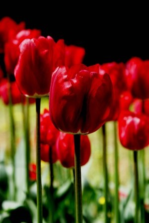

پدرم می‌گوید آن قدیم‌تر‌ها که لاله هنوز –مثل خون\- سرخ بود،

هر کس در باغچه‌ی کوچک خانه‌اش هر چقدر توانست لاله کاشت…

برای دل خودش،

و برای سرخ ماندن وطنش…

بعدها عده‌ای سرخی لاله‌ها را خریدند و هر کس هر چقدر توانست لاله کند و فروخت.

\- برای همین است که این روزها کمتر کسی سرخی لاله‌ها را می‌بیند!
