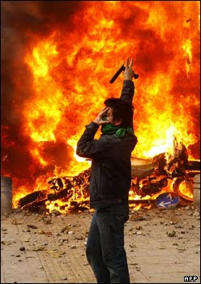

به کجا رفتیم؟ به کجا بردنمان؟! جنبش سبزمان آغشته شد به قرمزی خون نمی‌دانم کدامین انسان مخالف یا موافقی! چه شد که به اینجا رسید آن جنبش آرام چند میلیون نفری که بی‌صدا به دنبال رأی ربوده شده‌اش بود. چه شد که این‌گونه شیشه‌ها شکست٬ ساختمان‌ها سوخت و انسان‌ها کشته شدند! شعارهایمان را چه‌کسی این‌گونه مرگ‌بار کرد؟ باران گلوله بود این عاشورا یا باران خون نمی‌دانم، شهید شدند مردممان یا کشته نمی‌دانم، سبزی رویاهایمان چه شد که اینگونه سرخ شد؟

آن روزهای سبز را به یاد دارم که آرمانمان میرحسین بود و حقمان رأیمان بود. آن روزها، پاسخ گلوله‌ها گل بود،‌ آرام آرام می‌رفتیم، حساب شده می‌رفتیم، اگر کسی حرف از خشونت می‌گفت ما آرامش را به او می‌آموختیم. تمام تلاشمان این بود که به او که ما را آشوبگر خواند اثبات کنیم که ما صلح می‌طلبیم. کشتند ما را،با باطوم تنمان را سرخ کردند و با دروغ و تهمت خونمان را به جوش آوردند. حقمان را هر چه بیشتر طلب کردیم بیشتر پایمال کردند. شعار «رأی مرا پس دهید»مان مبدل شد به «مرگ بر خامنه‌ای» و جنبش آرام صلح‌طلبانه‌مان مبدل شد به تظاهراتی پر از آتش و خون و آرمانمان، میرحسینمان و رأیمان را نمی‌دانم چه شد! نمی‌دانم این تظاهرات خونین از کجا آمد و این شعار‌های مرگ‌بار چه طلب می‌کند؟

این مسیر که می‌رویم و این تا به اینجا پیش آمدنمان درست است؟! این سرکوب سرکوب‌گران و حمله به سران کشور از دست رفته‌مان ما را به راه درستی پیش خواهد راند یا دوباره ما را به سی سال فلاکت و توسری خوردن به نام دین و وطن و رهبر باز خواهد گرداند. در این سی سال کشورمان را آنچنان به مقدسات دروغین آغشته کرده‌اند که تصور بازگشتش به آنچه که سی سال پیش بود هم مضحک است چه رسد به بهتر شدنش. نمی‌دانم آرام بنشینیم و مسیر اصلاحات را پیش بریم یا تن دهیم به همین مسیر خونین انقلابی دیگر...؟
