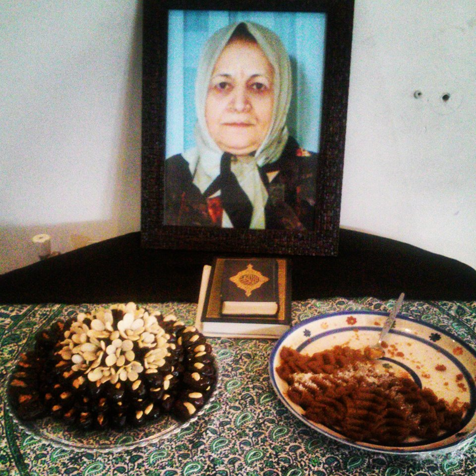

سرنگ‌های انسولین را پر کردم و در یخچال گذاشتم، هر کدام ۶ واحد، تا برای فردا و پس‌فردایش آماده باشند. خسته‌تر و کم‌حال تر از معمول بود اما مثل همیشه، چشمش که به من افتاد لبخند زد و پاهایش را کمی جمع کرد تا روی تخت، کنارش بنشینم. نشستم و چند دقیقه دست‌هایش را در دستانم فشردم و با لبخند حالش را پرسیدم و او با لبخند پاسخم را داد. وقت رفتن گفت انسولین‌ها یادت نرود. یادم نرفته بود. هیچ وقت یادم نرفته بود... رفتم.

پس‌فردایش که آمدم، انسولین‌ها هنوز همانجا، پشت در یخچال بودند. چشم‌هایش اما دیگر آنجا نبود تا مثل همیشه که مرا می‌دید لبخند بزند. پاهایش دیگر روی تخت جمع نشدند و من دیگر دست‌هایش را لمس نکردم. او رفته بود. برای همیشه رفته بود.
